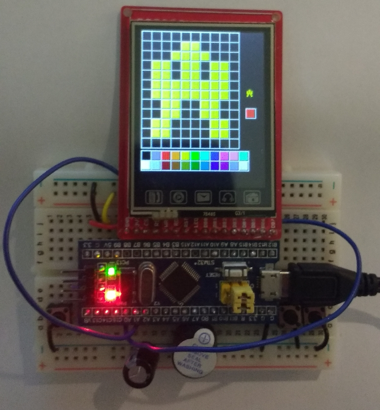

# BreadBoardGames-2019
Software for Breadboard games in Wexford in 2018 and Dublin 2019.  Mostly the same as last year with support for a wider 
range of screens.  Screen hardware usually differs in the areas of intiializatoin, opening apertures
and calibration values for the touch screen.
The 2018 events took place in the public libraries of County Wexford, Ireland
The first event in 2019 is in Kevin St. public library in Dublin, Ireland.

